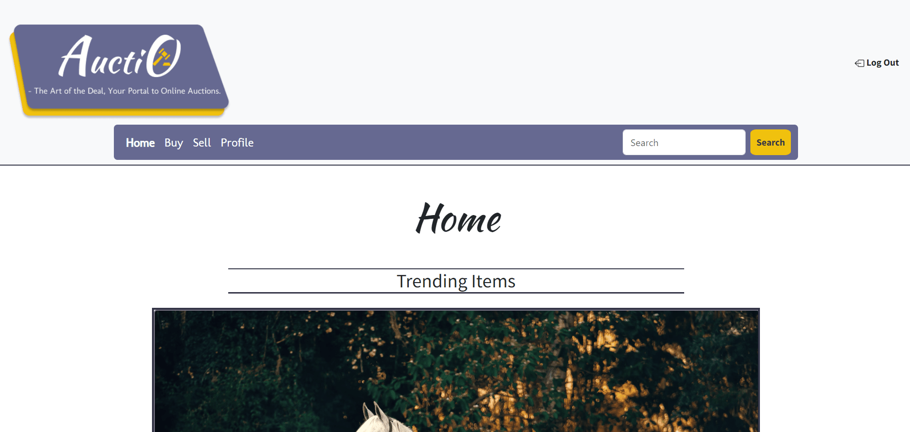

# Semester-Project-2

Auctio - The Art of the Deal, Your Portal to Online Auctions!

Course-assignment description:
Build an online auction house. An attractive and responsive client application should be developed using the provided API and documentation. This will enable users to sell items, view available products, and place bids on items they are interested in.

The site should only be build using css frameworks and vanilla JavaScript.

The Auctio website was made using SASS, Bootstrap, Vanilla JavaScript, and HTML. The design was created in Figma, and Trello and github projects were used for project management.

How to install -
Installation Steps:

1. Clone the repository using https://github.com/StormSkoglund/Semester-Project-2
2. To install the dependencies, please use the following command: "npm i".
3. Install live-server using "npm install live-server"
4. To run, type "npm run dev" in the terminal.
5. To launch live-server only, type "npm run start".

Static host : https://auctio.netlify.app/
